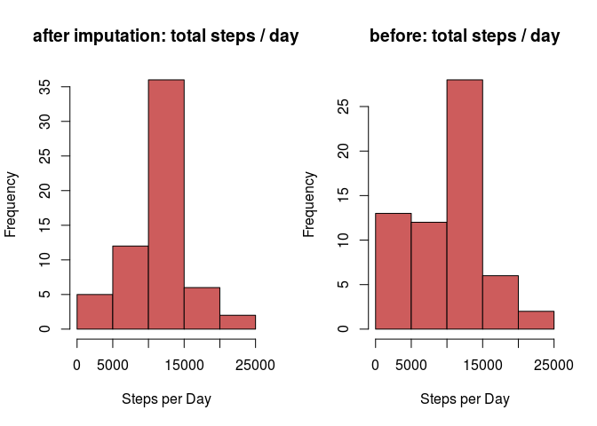
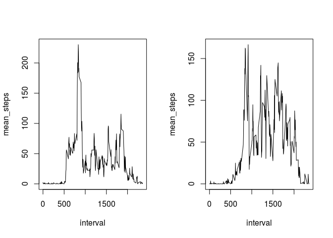

Loading and preprocessing the data
----------------------------------

First the data of a fitness tracker is loaded.

It contains three columns, the number of steps, the date and interval.

The data was recorded in October and November 2012 in 5 minute
intervals, which leads to 288 intervals per day

    activity <- read.csv("activity.csv")
    head(activity,3)

    ##   steps       date interval
    ## 1    NA 2012-10-01        0
    ## 2    NA 2012-10-01        5
    ## 3    NA 2012-10-01       10

    str(activity)

    ## 'data.frame':    17568 obs. of  3 variables:
    ##  $ steps   : int  NA NA NA NA NA NA NA NA NA NA ...
    ##  $ date    : Factor w/ 61 levels "2012-10-01","2012-10-02",..: 1 1 1 1 1 1 1 1 1 1 ...
    ##  $ interval: int  0 5 10 15 20 25 30 35 40 45 ...

The date column is transformed into a Date format.

    library(lubridate)

    ## 
    ## Attaching package: 'lubridate'

    ## The following object is masked from 'package:base':
    ## 
    ##     date

    activity$date <- ymd(activity$date)
    activity$day <- weekdays(activity$date)
    activity$month <- month(activity$date)
    activity$year <- year(activity$date)
    str(activity)

    ## 'data.frame':    17568 obs. of  6 variables:
    ##  $ steps   : int  NA NA NA NA NA NA NA NA NA NA ...
    ##  $ date    : Date, format: "2012-10-01" "2012-10-01" ...
    ##  $ interval: int  0 5 10 15 20 25 30 35 40 45 ...
    ##  $ day     : chr  "Montag" "Montag" "Montag" "Montag" ...
    ##  $ month   : num  10 10 10 10 10 10 10 10 10 10 ...
    ##  $ year    : num  2012 2012 2012 2012 2012 ...

What is the mean total number of steps taken per day?
-----------------------------------------------------

The steps taken on every day, were measured in 5 minute intervals. Now
they are summed up for each day.

    steps_per_day <- aggregate(activity$steps, by = list(activity$date), FUN = sum, na.rm = TRUE)
    names(steps_per_day) <- c("date", "steps")
    head(steps_per_day, 3)

    ##         date steps
    ## 1 2012-10-01     0
    ## 2 2012-10-02   126
    ## 3 2012-10-03 11352

The histgram shows the frequencies of total steps per day in intervals
of 5,000 steps.

    png(filename = "figure/hist_total_steps_per_day_without_imputation.png")
    hist(steps_per_day$steps,col = "indianred", main = "histogram of total steps per day", xlab = "Steps per Day")
    dev.off()

    ## png 
    ##   2

    hist(steps_per_day$steps,col = "indianred", main = "histogram of total steps per day", xlab = "Steps per Day")

Most often between 10,000 and 15,000 steps were taken.

The summary shows us that the mean number of total steps per day is
9,354 steps and the median 10,395 steps.

    summary(steps_per_day$steps)

    ##    Min. 1st Qu.  Median    Mean 3rd Qu.    Max. 
    ##       0    6778   10395    9354   12811   21194

What is the average daily activity pattern?
-------------------------------------------

    mean_steps_interval <- aggregate(activity$steps, by = list(activity$interval), FUN = mean, na.rm=TRUE)
    names(mean_steps_interval) <- c("interval", "mean_steps")
    png(filename = "figure/mean_steps_per_day_without_imputation.png")
    plot(mean_steps_interval, type="l")
    dev.off()

    ## png 
    ##   2

    plot(mean_steps_interval, type="l")

This figure shows the average daily activity pattern, which is measured
in 288 interval steps each for 5 minutes. The x-axis shows the time,
where 500 corresponds to 5 am and 20000 to 8 pm.

Now I'm aranging the data by the number of steps.

    head(mean_steps_interval, 3)

    ##   interval mean_steps
    ## 1        0  1.7169811
    ## 2        5  0.3396226
    ## 3       10  0.1320755

    library(dplyr)

    ## 
    ## Attaching package: 'dplyr'

    ## The following objects are masked from 'package:lubridate':
    ## 
    ##     intersect, setdiff, union

    ## The following objects are masked from 'package:stats':
    ## 
    ##     filter, lag

    ## The following objects are masked from 'package:base':
    ## 
    ##     intersect, setdiff, setequal, union

    mean_steps_interval <- tbl_df(mean_steps_interval)
    mean_steps_interval<- mean_steps_interval %>% arrange(desc(mean_steps))
    head(mean_steps_interval,5)

    ## # A tibble: 5 x 2
    ##   interval mean_steps
    ##      <int>      <dbl>
    ## 1      835   206.1698
    ## 2      840   195.9245
    ## 3      850   183.3962
    ## 4      845   179.5660
    ## 5      830   177.3019

The highest number of average steps with 206 is in the time interval
between 8:35 and 8:40 am.

The five highest average number of steps are in the 25 minute interval
between 8:30-8:55 am.

Imputing missing values
-----------------------

The data contains a lot of missing values (NA's), in total 2304, which
is 13 %

    nr_missing <- 0 
    nr_missing <- sum(is.na(activity$steps))
    nr_missing*100/nrow(activity)

    ## [1] 13.11475

I first get the indices of the missing values and then loop over them
and impute mean values. I save everything in a new datframe for
comparison later.

    activity_impute <- data.frame(activity)
    index_na <- which(is.na(activity$steps))
    for(i in index_na){
      activity_impute$steps[i] <- mean_steps_interval$mean_steps[mean_steps_interval$interval == activity$interval[i]]
      #print( mean_steps_interval$mean_steps[mean_steps_interval$interval == activity$interval[i]])
    }

Test if it worked..

    sum(is.na(activity_impute$steps))

    ## [1] 0

So all the missing values are now replaced by the mean values of their
time interval.

Identifiying the impact of imputation
-------------------------------------

In the next step the histogram of total number of steps per day is
calculated again, as before.

    steps_per_day_impute <- aggregate(activity_impute$steps, by = list(activity_impute$date), FUN = sum, na.rm = TRUE)
    names(steps_per_day_impute) <- c("date", "steps")
    head(steps_per_day_impute, 3)

    ##         date    steps
    ## 1 2012-10-01 10766.19
    ## 2 2012-10-02   126.00
    ## 3 2012-10-03 11352.00

    png(filename = "figure/compare_imputation_hist_total_steps_per_day.png")
    par(mfrow=c(1,2))
    hist(steps_per_day_impute$steps,col = "indianred", main = "after imputation: total steps / day", xlab = "Steps per Day")
    hist(steps_per_day$steps,col = "indianred", main = "before: total steps / day", xlab = "Steps per Day")
    dev.off()

    ## png 
    ##   2

    par(mfrow=c(1,2))
    hist(steps_per_day_impute$steps,col = "indianred", main = "after imputation: total steps / day", xlab = "Steps per Day")
    hist(steps_per_day$steps,col = "indianred", main = "before: total steps / day", xlab = "Steps per Day")

The histogram looks quite different, than before... The peak is still
between 10,000 and 15,000. But the missing values in the number of steps
leads to a lot days where under 10,000 steps were taken, just because
the values are missing. So it is the best idea to impute mean values for
these times in order to get a reasonable analysis.

The mean number of steps before imputation was 9,354 steps and is now
10,766 steps. The median number of steps was without imputation 10,395
steps and extended now to 10,766 steps.

    summary(steps_per_day_impute$steps)

    ##    Min. 1st Qu.  Median    Mean 3rd Qu.    Max. 
    ##      41    9819   10766   10766   12811   21194

Are there differences in activity patterns between weekdays and weekends?
-------------------------------------------------------------------------

To answer this question we devide the dataset into weekday and weekend
data first.

    weekend = c("Samstag", "Sonntag")
    activity_weekend <- (activity_impute[activity_impute$day %in% weekend,])
    activity_weekdays <- (activity_impute[!activity_impute$day %in% weekend,])

Afterwards we calculate the time series plot, of average number of steps
in time intervals of 5 minutes again to compare wether the activity on
weekends differ from the mean activity during the week.

    mean_steps_interval_weekend <- aggregate(activity_weekend$steps, by = list(activity_weekend$interval), FUN = mean)
    mean_steps_interval_weekdays <- aggregate(activity_weekdays$steps, by = list(activity_weekdays$interval), FUN = mean)
    names(mean_steps_interval_weekend) <- c("interval", "mean_steps")
    names(mean_steps_interval_weekdays) <- c("interval", "mean_steps")
    png(filename = "figure/mean_steps_per_day_weekends_vs_weekdays.png")
    par(mfrow=c(1,2))
    plot(mean_steps_interval_weekdays, type="l")
    plot(mean_steps_interval_weekend, type="l")
    dev.off()

    ## png 
    ##   2

    par(mfrow=c(1,2))
    plot(mean_steps_interval_weekdays, type="l")
    plot(mean_steps_interval_weekend, type="l")

We can see much more activity during the day for weekends and also some
activity late in the night.
